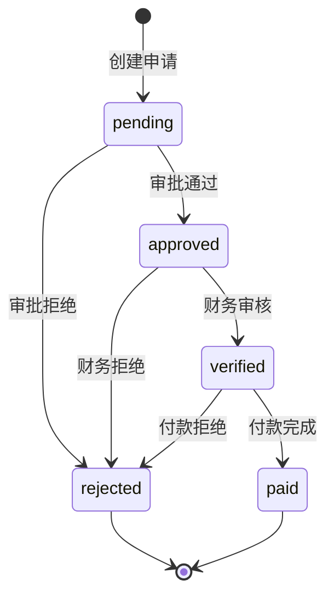

# Design - 费用报销管理

## 整体架构图

```mermaid
flowchart TD
    subgraph API Layer
        A1[POST /expenses]
        A2[GET /expenses/{id}]
        A3[GET /expenses]
        A4[POST /expenses/{id}/approve]
        A5[POST /expenses/{id}/reject]
        A6[POST /expenses/{id}/verify]
        A7[POST /expenses/{id}/pay]
    end

    subgraph Business Logic
        B1[创建报销申请]
        B2[计算审批级别]
        B3[审批处理]
        B4[财务审核]
        B5[付款处理]
    end

    subgraph Data Storage
        D1[app.state.expenses]
    end

    subgraph Metrics
        M1[expense_requests_total]
        M2[expense_approvals_total]
        M3[expense_verifications_total]
        M4[expense_payments_total]
    end

    A1 --> B1 --> B2 --> D1
    A4 --> B3 --> D1
    A5 --> B3
    A6 --> B4 --> D1
    A7 --> B5 --> D1
    B1 --> M1
    B3 --> M2
    B4 --> M3
    B5 --> M4
```

## 状态流转图



## 数据模型设计

### Pydantic 模型

```python
class ExpenseItemPayload(BaseModel):
    category: str
    amount: float
    description: str | None = None

class ExpenseCreatePayload(BaseModel):
    employee_id: int
    expense_type: str
    items: list[ExpenseItemPayload]
    description: str | None = None

class ExpenseApprovePayload(BaseModel):
    approver: str

class ExpenseRejectPayload(BaseModel):
    approver: str
    reason: str

class ExpenseVerifyPayload(BaseModel):
    verifier: str

class ExpensePayPayload(BaseModel):
    payer: str
    payment_ref: str | None = None
```

## 审批级别计算

```python
def calculate_approval_level(total_amount: float) -> str:
    if total_amount <= 500:
        return "supervisor"
    elif total_amount <= 2000:
        return "manager"
    else:
        return "director"
```

## 接口契约

### POST /expenses
- 输入: ExpenseCreatePayload
- 输出: ExpenseRequest
- 状态码: 200 成功, 400 参数错误, 404 员工不存在

### POST /expenses/{id}/approve
- 输入: ExpenseApprovePayload
- 前置条件: status == "pending"
- 输出: ExpenseRequest
- 状态码: 200 成功, 404 不存在, 409 状态冲突

### POST /expenses/{id}/verify
- 输入: ExpenseVerifyPayload
- 前置条件: status == "approved"
- 输出: ExpenseRequest

### POST /expenses/{id}/pay
- 输入: ExpensePayPayload
- 前置条件: status == "verified"
- 输出: ExpenseRequest

## 指标定义

| 指标名 | 类型 | 标签 | 描述 |
|--------|------|------|------|
| expense_requests_total | Counter | expense_type, required_level | 报销申请数 |
| expense_approvals_total | Counter | status | 审批决策数 |
| expense_verifications_total | Counter | - | 财务审核数 |
| expense_payments_total | Counter | - | 付款完成数 |
